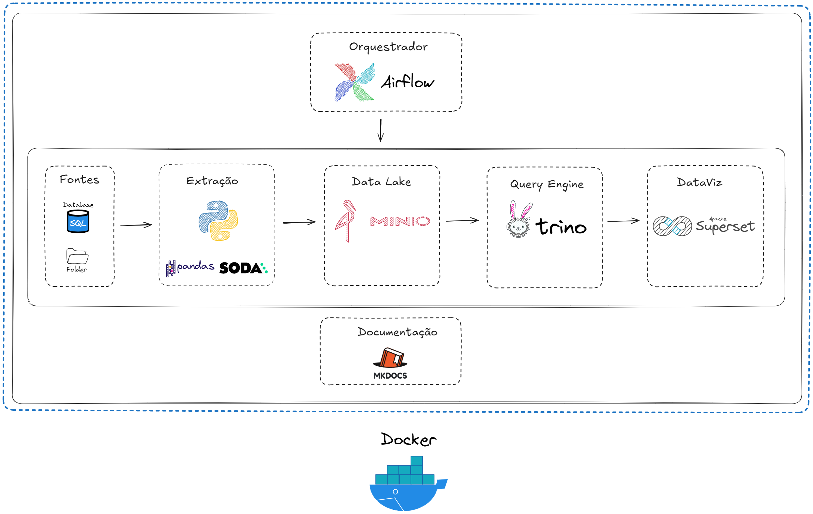

# Documentação do Pipeline de Dados

Este projeto documenta a construção de um pipeline escalável utilizando tecnologias open-source como Docker, Airflow, MinIO, Trino, Superset e MkDocs.

## Objetivos
- Processamento eficiente de grandes volumes de dados.
- Integração de ferramentas open-source.
- Escalabilidade e modularidade.
