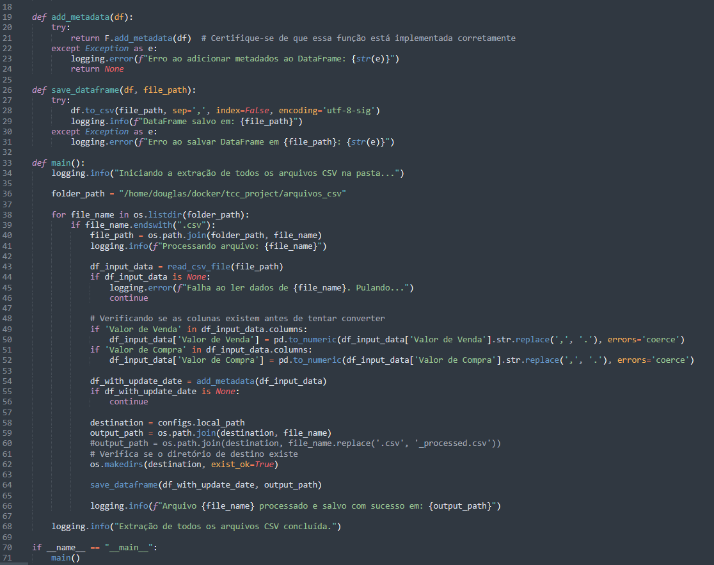
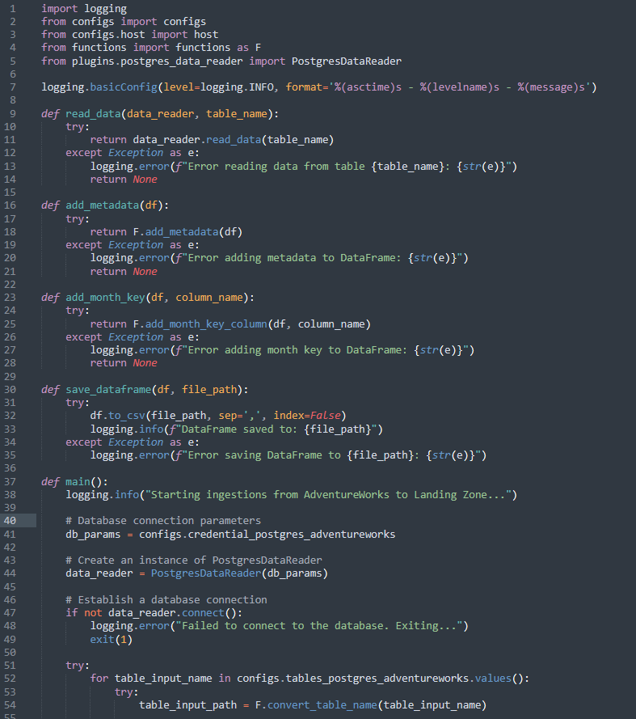
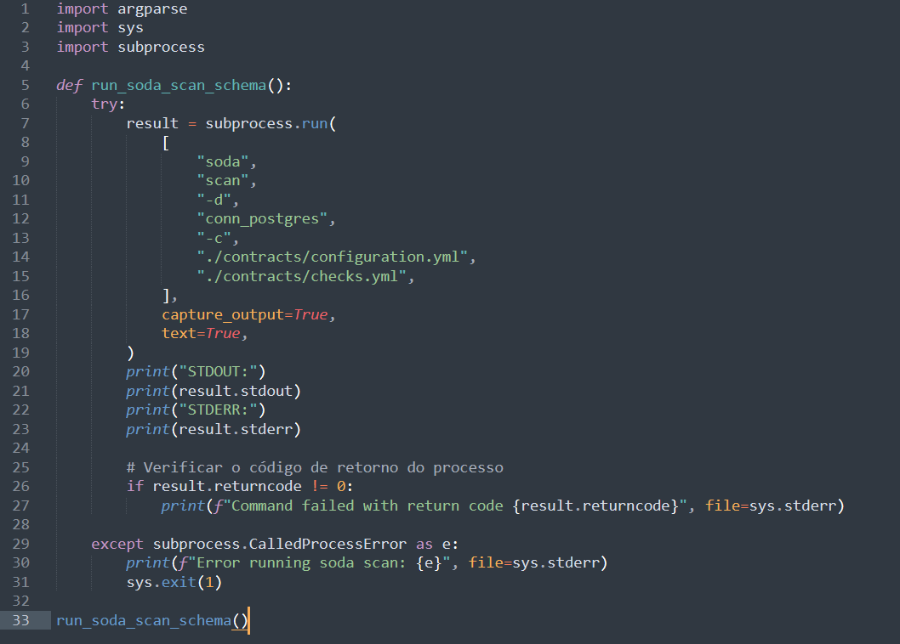
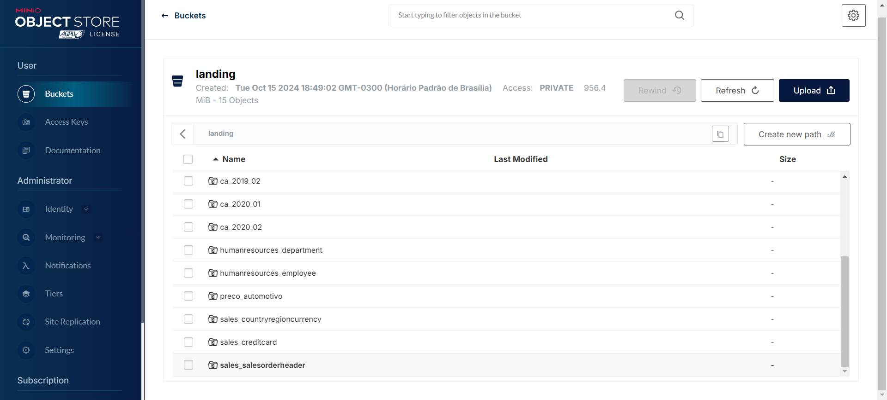

# Pipeline ETL

O pipeline ETL (Extração, Transformação e Carga) foi implementado utilizando Python e Pandas. Esta seção descreve cada uma das etapas principais.

## Extração de Dados
Exemplo de Extração utilizando arquivos csv:

Exemplo de Extração utilizando banco de dados:

## Transformação de DataQuality

## Carregamento de Dados no Minio

