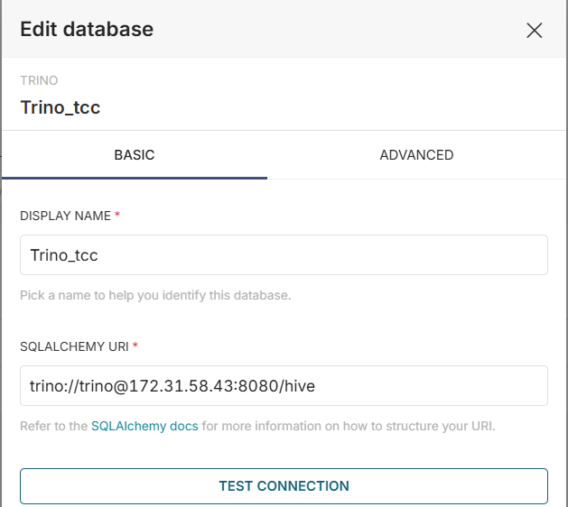

# Visualização dos Dados no Apache Superset

## Introdução

O Apache Superset é uma ferramenta de visualização de dados que permite a criação de dashboards interativos e gráficos a partir de diversas fontes de dados. No contexto deste projeto, o Superset é utilizado para se conectar ao Trino e acessar os dados armazenados no MinIO.

## Configuração da Conexão com o Trino

Para conectar o Superset ao Trino, foi configurado o seguinte URI de conexão:

