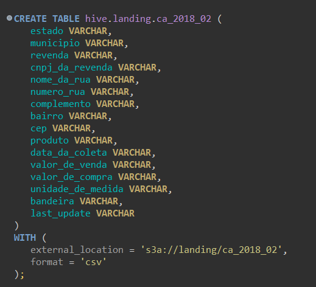

# Integração com Trino e MinIO

O **Trino** foi configurado para consultar dados processados e armazenados no **MinIO**, proporcionando uma camada de consulta SQL rápida e eficiente. Nesta seção, explicamos como o Trino foi configurado para acessar o bucket `landing` no MinIO e realizar consultas nos dados.

---

## **Configuração da Tabela no Trino**

Os dados do MinIO foram expostos ao Trino utilizando a tabela abaixo:

## *Código da tabela*
